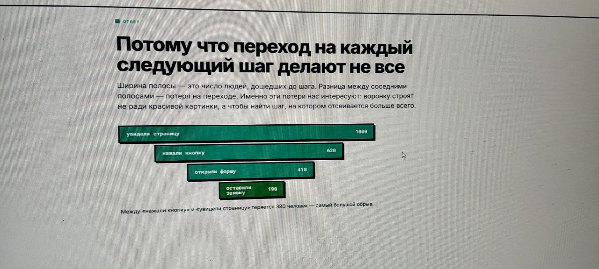

## Аналитика в вебе
### Что происходит при открытии сайта?

Открытие страницы — это не один запрос, а несколько десятков. Часть из них не влияет на отображение страницы: они уходят на серверы аналитики и сообщают, что страницу открыли.

### Воронка
Это путь клиента, разбитый на шаги, на каждом из которых часть людей отсеивается.

Внимание → интерес → желание → действие.



#### Событие
Это зафиксированный факт действия, переданный в систему аналитики. У него есть имя, например `generate_lead`, и набор параметров. Событие отвечает на вопрос: «Что произошло?»

#### Заявка
Это запись с содержательными данными обращения: именем, контактом, текстом, источником и временем. Она хранится в таблице или системе управления заявками и отвечает на вопросы: «С кем?» и «О чём?». Одно нажатие кнопки — это событие; заявка появляется только тогда, когда человек заполнил и отправил форму.

#### CRM
CRM — это система управления взаимоотношениями с клиентами. В ней хранятся заявки и их статусы.

### Письмо аналитики
Когда пользователь выполняет действие, сайт отправляет в систему аналитики запрос с параметрами события. Например:

```text
tid=G-4X...            # идентификатор счётчика: куда поступит событие
en=generate_lead       # имя события
dl=https://site.ru/... # адрес открытой страницы
dt=Страница контактов  # заголовок страницы
```

По этим данным можно понять, какое событие произошло, на какой странице и в каком счётчике его нужно учесть.

#### Точка разрыва
Стык двух шагов или систем, на котором данные теряются при отправке.
Чаще всего это происходит из-за ошибок в разметке источников.
