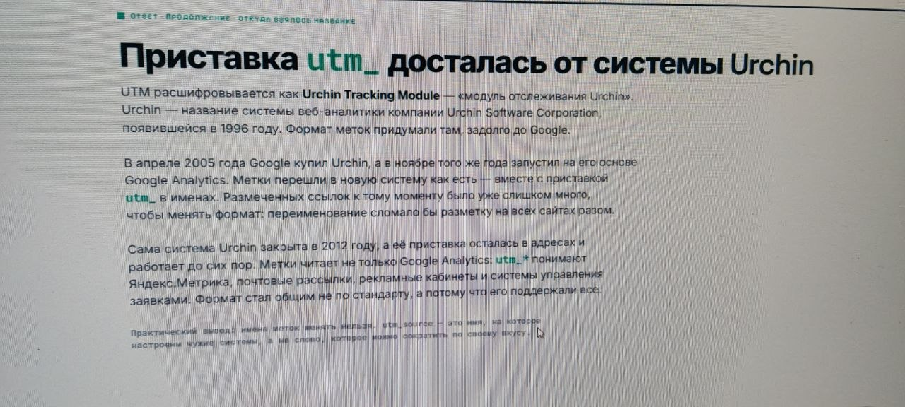

[← Оглавление](../../README.md) · [Домашняя работа](../hw/research_01.md)

### Части: схема, узел, путь

### Обозначение UTM
Это пара «имя=значение» в URL, описывающая источник перехода.
#### Зачем нужна?
Чтобы у каждой заявки было известно, откуда пришёл лид.

### Как появилась?

