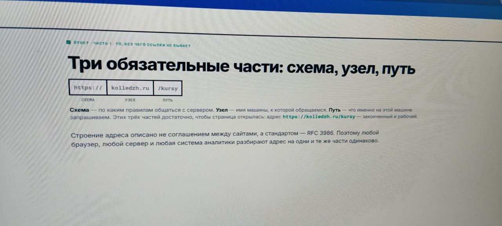
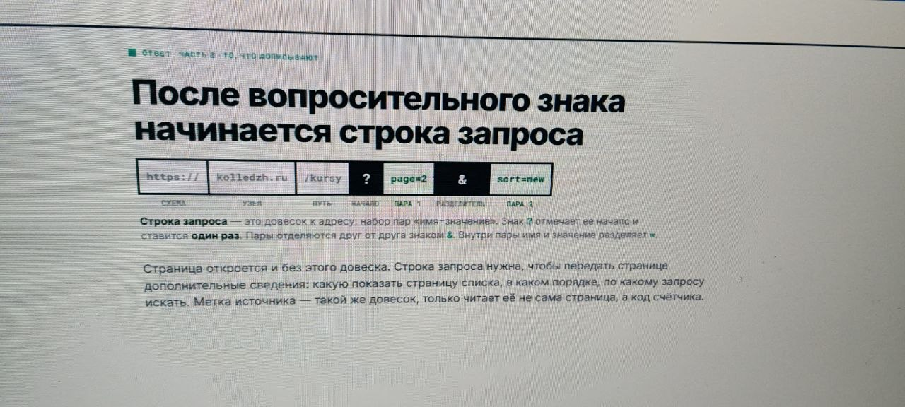

[← Оглавление](../../README.md) · [Домашняя работа](../hw/homework_02.md)

# UTM-метки

## Части URL: схема, узел и путь

## Строка запроса

## Обозначение UTM

Это пара «имя=значение» в URL, описывающая источник перехода.

### Зачем нужна UTM-метка?

Чтобы у каждой заявки было известно, откуда пришёл лид.

## Как появилась UTM-разметка?

