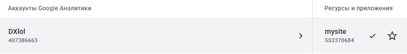
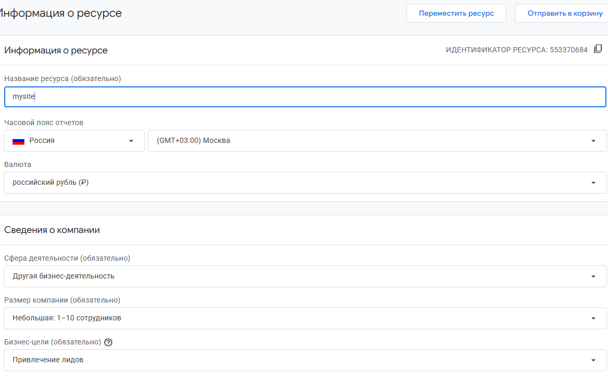
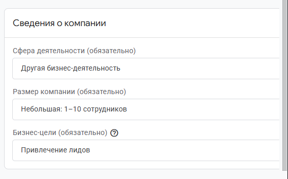
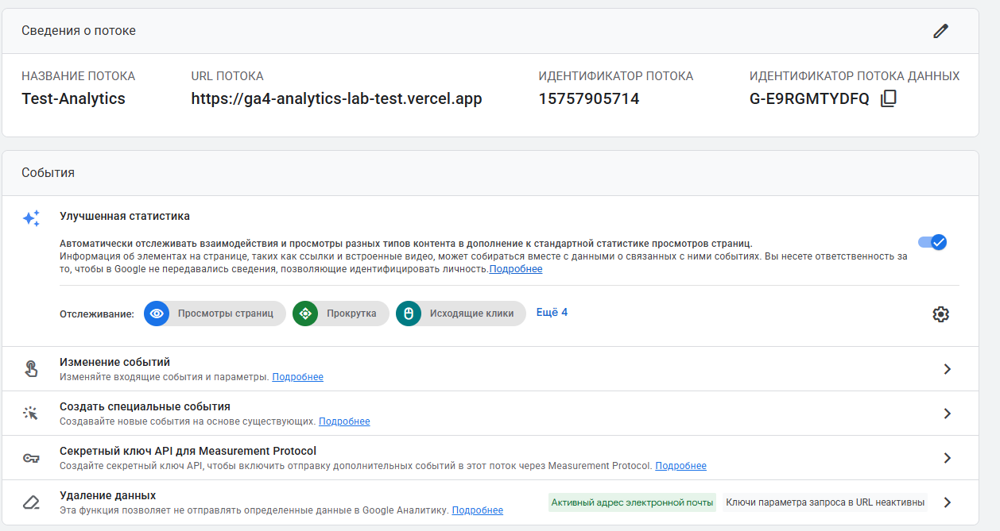
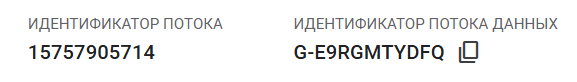

[← Оглавление](../../README.md) · [Конспект занятия](../class/UTM-метки.md)

# Домашнее задание 2. Воронка и Google Analytics 4

## Что нужно было сделать

## Часть 1. Исследование воронки

### 1.1. Объект исследования

| Поле | Значение |
|---|---|
| Компания, сервис или отрасль |  |
| Адрес сайта или приложения |  |
| Целевое действие |  |
| Почему выбран этот объект |  |

### 1.2. Воронка

От 4 до 7 этапов, по порядку.

| № | Этап | Что считается переходом дальше | Метрика этапа |
|---|---|---|---|
| 1 |  |  |  |
| 2 |  |  |  |
| 3 |  |  |  |
| 4 |  |  |  |

### 1.3. Источники

Нужно использовать не менее пяти источников. Каждый источник разбирается по пяти пунктам.

#### Источник 1

| Поле | Значение |
|---|---|
| Название материала |  |
| Автор или организация |  |
| Дата публикации |  |
| Прямая ссылка |  |

**Выписка из материала** (ключевая мысль, цифра, наблюдение, результат):

>

**Что подтверждает и как связано с моей воронкой** (своими словами):

>

**Цифры из источника и этап воронки, к которому относятся:**

>

#### Источник 2

| Поле | Значение |
|---|---|
| Название материала |  |
| Автор или организация |  |
| Дата публикации |  |
| Прямая ссылка |  |

**Выписка из материала:**

>

**Что подтверждает и как связано с моей воронкой:**

>

**Цифры из источника и этап воронки:**

>

#### Источник 3

| Поле | Значение |
|---|---|
| Название материала |  |
| Автор или организация |  |
| Дата публикации |  |
| Прямая ссылка |  |

**Выписка из материала:**

>

**Что подтверждает и как связано с моей воронкой:**

>

**Цифры из источника и этап воронки:**

>

#### Источник 4

| Поле | Значение |
|---|---|
| Название материала |  |
| Автор или организация |  |
| Дата публикации |  |
| Прямая ссылка |  |

**Выписка из материала:**

>

**Что подтверждает и как связано с моей воронкой:**

>

**Цифры из источника и этап воронки:**

>

#### Источник 5

| Поле | Значение |
|---|---|
| Название материала |  |
| Автор или организация |  |
| Дата публикации |  |
| Прямая ссылка |  |

**Выписка из материала:**

>

**Что подтверждает и как связано с моей воронкой:**

>

**Цифры из источника и этап воронки:**

>

### 1.4. Реальные кейсы

Не менее двух кейсов о российских компаниях или российском рынке. Каждый разбирается по семи пунктам. Если показатели не опубликованы, пишется: «Точные показатели в открытом источнике не приведены».

#### Кейс 1

| № | Пункт | Ответ |
|---|---|---|
| 1 | Компания, продукт или рынок |  |
| 2 | Как выглядела воронка или её проблемный участок |  |
| 3 | В чём заключалась проблема |  |
| 4 | Какие данные или наблюдения подтвердили проблему |  |
| 5 | Что изменили или протестировали |  |
| 6 | Как изменился результат |  |
| 7 | Переносим ли подход на мой объект |  |

**Ссылка на источник кейса:**

>

#### Кейс 2

| № | Пункт | Ответ |
|---|---|---|
| 1 | Компания, продукт или рынок |  |
| 2 | Как выглядела воронка или её проблемный участок |  |
| 3 | В чём заключалась проблема |  |
| 4 | Какие данные или наблюдения подтвердили проблему |  |
| 5 | Что изменили или протестировали |  |
| 6 | Как изменился результат |  |
| 7 | Переносим ли подход на мой объект |  |

**Ссылка на источник кейса:**

>

### 1.5. Причины потери пользователей

Нужно указать не менее трёх причин. Каждая из них опирается на найденные материалы.

| № | Этап воронки | Причина потери | Какой источник это подтверждает |
|---|---|---|---|
| 1 |  |  |  |
| 2 |  |  |  |
| 3 |  |  |  |

### 1.6. Гипотезы улучшения

Не менее трёх собственных гипотез.

| № | Этап | Гипотеза | Какие данные нужно собрать | Как проверить, сработало |
|---|---|---|---|---|
| 1 |  |  |  |  |
| 2 |  |  |  |  |
| 3 |  |  |  |  |

---

## Часть 2. Google Analytics 4

### 2.1. Пройденные шаги

| № | Шаг | Выполнено |
|---|---|---|
| 1 | Вход в Google Analytics под своим аккаунтом | да / нет |
| 2 | Создан Analytics Account | да / нет |
| 3 | Создан Property | да / нет |
| 4 | Выбраны часовой пояс, валюта и общие сведения | да / нет |
| 5 | Выбраны бизнес-цели | да / нет |
| 6 | Создан ресурс | да / нет |
| 7 | Создан Web Data Stream | да / нет |
| 8 | Проверены Website URL, Stream name, Enhanced Measurement | да / нет |
| 9 | Поток создан | да / нет |
| 10 | Найден Measurement ID | да / нет |

### 2.2. Что получилось

| Поле | Значение |
|---|---|
| Analytics Account |  |
| Property |  |
| Reporting time zone |  |
| Currency |  |
| Выбранные бизнес-цели |  |
| Stream name |  |
| Website URL |  |
| Stream ID (числовой) |  |
| Measurement ID (`G-…`) |  |
| Enhanced Measurement | включено / выключено |

Stream ID и Measurement ID — это разные идентификаторы. На сайт в задании 3 ставится второй, вида `G-XXXXXXXXXX`.

### 2.3. Скриншоты

- [Аккаунт и ресурс GA4](../../.github/assets/lesson_02/01-ga4-account-and-property.png)

- [Настройки ресурса GA4](../../.github/assets/lesson_02/02-ga4-property-settings.png)

- [Бизнес-цели GA4](../../.github/assets/lesson_02/03-ga4-business-goals.png)

- [Сведения о веб-потоке GA4](../../.github/assets/lesson_02/04-ga4-web-stream-details.png)

- [Идентификаторы веб-потока GA4](../../.github/assets/lesson_02/05-ga4-stream-identifiers.png)

---

### Использование ИИ

Источники вы ищете, читаете и проверяете сами, настройку проходите тоже
сами. ИИ допускается для поиска идей, структурирования и проверки
формулировок, но источником он не считается.

| Вопрос | Ответ |
|---|---|
| Что сделано самостоятельно |  |
| Что спрошено у модели |  |
| Что после этого проверено и изменено |  |

## Решение

## Часть 1. Исследование воронки

### 1.1. Объект исследования

| Поле                         | Значение                                                                                                                               |
| ---------------------------- | -------------------------------------------------------------------------------------------------------------------------------------- |
| Компания, сервис или отрасль | Яндекс Маркет                                                                                                 |
| Адрес сайта или приложения   | [market.yandex.ru](https://market.yandex.ru/)                                                                                          |
| Целевое действие             | Оплаченный заказ. Путь пользователя проходит через поиск, карточку товара и корзину.                                                  |
| Почему выбран этот объект    | На сайте можно проследить путь пользователя. Также есть официальная справка и материалы для продавцов.                               |

### 1.2. Воронка

От 4 до 7 этапов, по порядку.

| №   | Этап                      | Что считается переходом дальше                                            | Метрика этапа                                                       |
| --- | ------------------------- | ------------------------------------------------------------------------- | ------------------------------------------------------------------- |
| 1   | Посещение Маркета         | Пользователь открыл результаты поиска или каталог.                        | Доля посетителей, которые перешли к поиску или каталогу.            |
| 2   | Поиск и выбор предложения | Пользователь открыл карточку из выдачи.                                   | Доля пользователей выдачи, которые открыли карточку.                |
| 3   | Карточка товара           | Товар успешно добавлен в корзину.                                         | Доля посетителей карточки, которые добавили этот товар.             |
| 4   | Корзина                   | Пользователь нажал «Перейти к оформлению», форма открылась.               | Доля пользователей с товаром в корзине, которые начали оформление.  |
| 5   | Оформление                | Выбраны доставка и онлайн-оплата, получено подтверждение успешной оплаты. | Доля начавших оформление, которые оплатили заказ.                   |
| 6   | Оплаченный заказ          | Цель достигнута, следующего шага в этой воронке нет.                      | Число оплаченных заказов; доля посетителей, которые оплатили заказ. |

### 1.3. Источники

#### Источник 1

| Поле                  | Значение                                                    |
| --------------------- | ----------------------------------------------------------- |
| Название материала    | Корзина                                                     |
| Автор или организация | Яндекс Маркет, официальная справка                          |
| Дата публикации       | Не указана.                                                 |
| Прямая ссылка         | [Корзина](https://yandex.ru/support/market/ru/order/basket) |

**Выписка из материала:**

> Краткий пересказ: до оформления цена и наличие не закрепляются. Товары разных продавцов могут попасть в разные посылки со своими сроками доставки.

**Что подтверждает и как связано с моей воронкой:**

> На переходе из корзины к оформлению условия могут измениться. Покупатель может отказаться от заказа из-за отсутствия товара или неудобной доставки.

**Цифры из источника и этап воронки, к которому относятся:**

> Проценты потерь и конверсии не приведены. Материал относится к этапам 4–5.

#### Источник 2

| Поле                  | Значение                                                                                                        |
| --------------------- | --------------------------------------------------------------------------------------------------------------- |
| Название материала    | Запустим ваши продажи: скидка до 44% за наш счет вашим первым покупателям                                       |
| Автор или организация | Яндекс Маркет, журнал для продавцов                                                                             |
| Дата публикации       | 25.01.2025                                                                                                      |
| Прямая ссылка         | [Советы Маркета по продажам](https://partner.market.yandex.ru/chtojournal/start-on-marketplace_prymaya_skidka/) |

**Выписка из материала:**

> Краткий пересказ раздела об отзывах: 70% покупателей читают отзывы перед заказом. Товары с десятью положительными отзывами покупают в полтора раза чаще, чем товары без отзывов.

**Что подтверждает и как связано с моей воронкой:**

> Отзывы помогают принять решение в карточке. Их отсутствие может снизить доверие к товару.

**Цифры из источника и этап воронки:**

> 70%, десять положительных отзывов, в полтора раза чаще — выбор товара и дальнейшая покупка, этапы 3–6.

#### Источник 3

| Поле                  | Значение                                                                                           |
| --------------------- | -------------------------------------------------------------------------------------------------- |
| Название материала    | Data Science в обувном магазине: предсказали поведение клиентов и увеличили конверсию сайта на 16% |
| Автор или организация | Блог Mindbox на Хабре; опыт директора по маркетингу Mario Berluchi Азамата Тибилова                |
| Дата публикации       | 22.09.2020                                                                                         |
| Прямая ссылка         | [Кейс Mario Berluchi](https://habr.com/ru/companies/mindbox/articles/520182/)                      |

**Выписка из материала:**

> Краткий пересказ: магазин прогнозировал уход посетителя и показывал предложение в корзине выбранной группе. Эффект проверили A/B-тестом.

**Что подтверждает и как связано с моей воронкой:**

> Поведение в корзине помогает выбрать момент для предложения. Подход можно проверить на этапах 4–6 Яндекс Маркета.

**Цифры из источника и этап воронки:**

> Конверсия сайта выросла на 16,5%, средняя выручка на пользователя — на 35,7%, доля брошенных корзин снизилась на 17,2%. Сравнение проводили с контрольной группой, заявленная достоверность — 95%. Этапы 4–6.

#### Источник 4

| Поле                  | Значение                                                                           |
| --------------------- | ---------------------------------------------------------------------------------- |
| Название материала    | Как «Лазурит» увеличил выручку от брошенной корзины на 84%: сегментация и AAB-тест |
| Автор или организация | Дарья Воронина, Mindbox; опыт CRM-маркетолога «Лазурита» Виктории Гордиенко        |
| Дата публикации       | 20.04.2022                                                                         |
| Прямая ссылка         | [Кейс «Лазурита»](https://mindbox.ru/journal/cases/lazurit/)                       |

**Выписка из материала:**

> Краткий пересказ: одинаковые письма заменили предложениями для разных корзин. Компания также заметила, что часть людей складывает в корзину варианты для сравнения.

**Что подтверждает и как связано с моей воронкой:**

> Добавление товара ещё не означает готовность купить. На этапе 4 нужно учитывать состав корзины, а не только её сумму.

**Цифры из источника и этап воронки:**

> Для обновлённых коммуникаций: +84% к выручке, +139% к конверсии в заказ, +140% к количеству заказов, +16% пользователей, которые перешли на сайт. Этапы 4–6. Компания называет результаты приблизительными.

#### Источник 5

| Поле                  | Значение                                                                                                  |
| --------------------- | --------------------------------------------------------------------------------------------------------- |
| Название материала    | Триггерная рассылка «брошенная корзина»: инструкция по запуску для маркетолога                            |
| Автор или организация | Mindbox                                                                                                   |
| Дата публикации       | 06.04.2023                                                                                                |
| Прямая ссылка         | [Причины ухода и напоминания о корзине](https://mindbox.ru/journal/education/broshennaya-korzina-zapusk/) |

**Выписка из материала:**

> Краткий пересказ: покупатель может найти дешевле, отложить покупку, не понять условия доставки, отвлечься или столкнуться с технической ошибкой.

**Что подтверждает и как связано с моей воронкой:**

> У ухода из корзины бывает несколько причин. Для их проверки нужны данные об ошибках и обратная связь покупателей.

**Цифры из источника и этап воронки:**

> У INCANTO конверсия в заказ для первого письма — 0,4%, для второго и третьего — по 0,5%. Это показатели писем о корзине на этапах 4–6.

### 1.4. Реальные кейсы

Не менее двух кейсов о российских компаниях или российском рынке. Каждый разбирается по семи пунктам. Если показатели не опубликованы, пишется: «Точные показатели в открытом источнике не приведены».

#### Кейс 1

| №   | Пункт                                            | Ответ                                                                                                     |
| --- | ------------------------------------------------ | --------------------------------------------------------------------------------------------------------- |
| 1   | Компания, продукт или рынок                      | Mario Berluchi, российский производитель обуви.                                                           |
| 2   | Как выглядела воронка или её проблемный участок  | Товар в корзине → решение купить → заказ.                                                                 |
| 3   | В чём заключалась проблема                       | Часть посетителей уходила без покупки; нужно было повысить выручку.                                       |
| 4   | Какие данные или наблюдения подтвердили проблему | Собирали просмотры карточек, добавления в корзину и покупки. Исходная доля брошенных корзин не приведена. |
| 5   | Что изменили или протестировали                  | По прогнозу поведения показывали всплывающее предложение в корзине. Контрольная группа его не видела.     |
| 6   | Как изменился результат                          | В A/B-тесте: конверсия +16,5%, ARPU +35,7%, доля брошенных корзин −17,2%.                                 |
| 7   | Переносим ли подход на мой объект                | Да, как идею теста для отдельных групп. Результат на Маркете нужно измерить заново.                       |

**Ссылка на источник кейса:**

> [Mindbox: Mario Berluchi](https://habr.com/ru/companies/mindbox/articles/520182/).

#### Кейс 2

| №   | Пункт                                            | Ответ                                                                                                                          |
| --- | ------------------------------------------------ | ------------------------------------------------------------------------------------------------------------------------------ |
| 1   | Компания, продукт или рынок                      | «Лазурит», российская мебельная сеть.                                                                                          |
| 2   | Как выглядела воронка или её проблемный участок  | Брошенная корзина → письмо → возврат → заказ.                                                                                  |
| 3   | В чём заключалась проблема                       | Клиентская база росла, а выручка от напоминаний о корзине не увеличивалась.                                                    |
| 4   | Какие данные или наблюдения подтвердили проблему | Сравнили результаты цепочек; заметили корзины с несколькими вариантами одного товара.                                          |
| 5   | Что изменили или протестировали                  | Выделили семь сегментов по сумме корзины. Проверяли новые предложения AAB-тестами: две группы со старым письмом, одна с новым. |
| 6   | Как изменился результат                          | Приблизительно +84% к выручке и +139% к конверсии коммуникаций о корзине. Ограничения расчёта указаны в источнике 4.           |
| 7   | Переносим ли подход на мой объект                | Да. Маркету можно проверять напоминания по составу корзины. Скидку не стоит предлагать всем одинаково.                         |

**Ссылка на источник кейса:**

> [Mindbox: «Лазурит»](https://mindbox.ru/journal/cases/lazurit/).

### 1.5. Причины потери пользователей

Нужно указать не менее трёх причин. Каждая из них опирается на найденные материалы.

| №   | Этап воронки         | Причина потери                                                         | Какой источник это подтверждает                                                                                                            |
| --- | -------------------- | ---------------------------------------------------------------------- | ------------------------------------------------------------------------------------------------------------------------------------------ |
| 1   | Карточка → корзина   | Недостаток отзывов может мешать доверию к товару.                      | Источник 2: связь отзывов и покупок. Причина для Маркета требует отдельной проверки.                                                       |
| 2   | Корзина → оформление | Товар стал недоступен, цена или доставка перестали устраивать.         | Источник 1: наличие не резервируется; источник 5: цена и непонятная доставка среди причин ухода. Недоступность также наблюдалась на сайте. |
| 3   | Корзина → заказ      | Пользователь пока только сравнивает варианты или откладывает покупку.  | Источники 4 и 5: корзину используют как список для сравнения или на будущее.                                                               |

### 1.6. Гипотезы улучшения

Не менее трёх собственных гипотез.

| №   | Этап                 | Гипотеза                                                                                                                                                 | Какие данные нужно собрать                                                               | Как проверить, сработало                                                                                                                             |
| --- | -------------------- | -------------------------------------------------------------------------------------------------------------------------------------------------------- | ---------------------------------------------------------------------------------------- | ---------------------------------------------------------------------------------------------------------------------------------------------------- |
| 1   | Карточка → корзина   | Если рядом с кнопкой покупки показать краткий блок уже имеющихся отзывов с фото, выбирать станет проще.                                                  | Показы блока, просмотры отзывов, добавления товара, оплаты, возвраты.                    | A/B-тест старого и нового расположения. Сравнить долю добавлений среди посетителей карточки; проверить, что доля оплат не снизилась.                 |
| 2   | Корзина → оформление | Если у недоступного товара показать доступные аналоги с ценой и сроком доставки, часть пользователей продолжит покупку.                                  | Показы недоступного товара, показы и выбор аналогов, начало оформления, оплаты.          | A/B-тест обычной кнопки «Похожие» и готового списка аналогов. Главная метрика — доля оплат среди пользователей с недоступным товаром.                |
| 3   | Корзина → заказ      | Если содержание напоминания зависит от состава корзины, заказов будет больше. Для похожих товаров — помощь в сравнении, для одного товара — напоминание. | Состав корзины, время ухода, согласие на рассылку, отправки, переходы, оплаты и отписки. | Сравнить текущие напоминания с новыми на случайных группах. Измерить долю оплат за 7 дней после включения в тест, выручку на пользователя и отписки. |

Мой вывод: сначала стоит проверить доступность товаров и переход из корзины к оформлению. Затем можно тестировать отзывы и напоминания. По открытым материалам нельзя точно установить, на каком этапе Яндекс Маркет теряет клиентов.

---

## Часть 2. Google Analytics 4

### 2.1. Пройденные шаги

|  №  | Шаг                                                      | Выполнено |
| :-: | -------------------------------------------------------- | :-------: |
|  1  | Вход в Google Analytics под своим аккаунтом              |    да     |
|  2  | Создан Analytics Account                                 |    да     |
|  3  | Создан Property                                          |    да     |
|  4  | Выбраны часовой пояс, валюта и общие сведения            |    да     |
|  5  | Выбраны бизнес-цели                                      |    да     |
|  6  | Создан ресурс                                            |    да     |
|  7  | Создан Web Data Stream                                   |    да     |
|  8  | Проверены Website URL, Stream name, Enhanced Measurement |    да     |
|  9  | Поток создан                                             |    да     |
| 10  | Найден Measurement ID                                    |    да     |

### 2.2. Что получилось

| Поле                   |                 Значение                  |
| ---------------------- | :---------------------------------------: |
| Analytics Account      |             Example Account               |
| Property               |             Example Property              |
| Reporting time zone    |           (GMT + 03:00) Москва            |
| Currency               |                  Рубль ₽                  |
| Выбранные бизнес-цели  |             Привлечение лидов             |
| Stream name            |              Test-Analytics               |
| Website URL            | https://ga4-analytics-lab-test.vercel.app |
| Stream ID (числовой)   |                15757905714                |
| Measurement ID (`G-…`) |               G-E9RGMTYDFQ                |
| Enhanced Measurement   |                 включено                  |

Stream ID и Measurement ID — это разные идентификаторы. На сайт в задании 3 ставится второй, вида `G-XXXXXXXXXX`.

### 2.3. Скриншоты

---

### Использование ИИ

Источники вы ищете, читаете и проверяете сами, настройку проходите тоже
сами. ИИ допускается для поиска идей, структурирования и проверки
формулировок, но источником он не считается.

| Вопрос                               | Ответ                                                                                                                                                     |
| ------------------------------------ | --------------------------------------------------------------------------------------------------------------------------------------------------------- |
| Что сделано самостоятельно           | Выбор объекта, редактирование и извлечение информации из статей и документации, выполнение всей части 2, построение воронки и другие задания.             |
| Что спрошено у модели                | Подбор источников согласно моей воронке, редактирование и сокращение текста до информативного вида, полная проверка орфографии и другие задачи.           |
| Что после этого проверено и изменено | Проверены достоверность источников и соответствие контексту задания; упрощены формулировки, удалены лишние слова и детали из ответов.                     |
