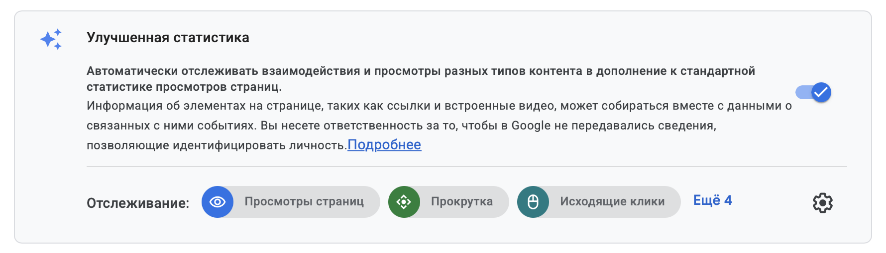
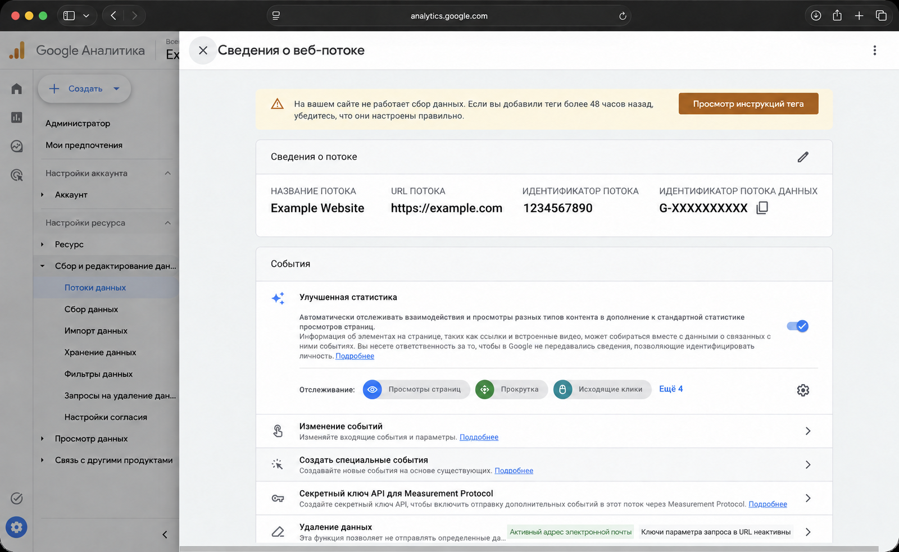
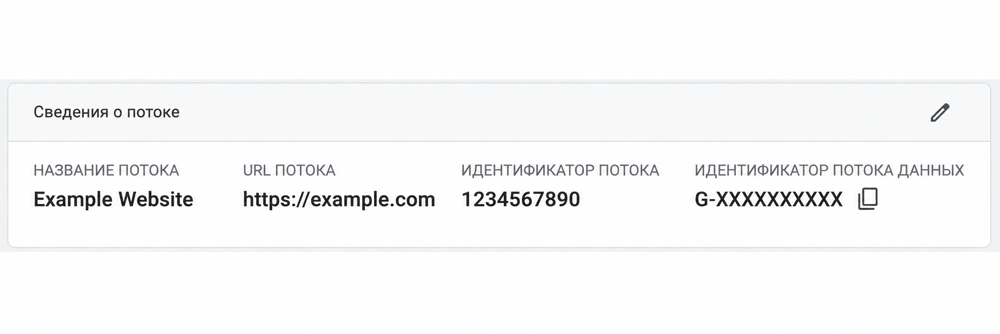

[← Оглавление](../../README.md)

# Google Analytics 4

Google Analytics 4 (GA4) — система веб-аналитики. Она показывает:

- кто приходит на сайт;
- откуда приходят пользователи;
- какие страницы они открывают;
- что делают на сайте;
- какие источники приводят к заявкам и покупкам.

## Как GA4 связывает источник и поведение

UTM-метки описывают источник перехода. GA4 сохраняет эту информацию и связывает её с дальнейшими действиями пользователя на сайте.

Пример пути пользователя:

`Telegram → ссылка с UTM → сайт → события → отчёт GA4`

Так можно увидеть не только число посетителей, но и результат конкретного источника: интерес к странице, заявку или покупку.

## События

GA4 получает информацию о действиях в виде событий.

- `page_view` — просмотр страницы;
- `scroll` — прокрутка страницы;
- `click` — переход по исходящей ссылке;
- `generate_lead` — получение заявки;
- `sign_up` — регистрация;
- `purchase` — покупка.

Некоторые события собираются автоматически. Заявки, регистрации и покупки обычно передаются отдельно в нужный момент.

Событие `click` не означает любой клик на сайте. В стандартном автоматическом сборе оно связано прежде всего с переходами по исходящим ссылкам.

## Структура GA4

GA4 состоит из нескольких уровней:

| Уровень | Назначение |
|---|---|
| **Account** | Владелец аналитики: организация или человек. |
| **Property** | Ресурс конкретного проекта. Хранит события, отчёты, аудитории и настройки. |
| **Data Stream** | Источник данных: сайт, Android- или iOS-приложение. |
| **Measurement ID** | Идентификатор веб-потока, в который сайт отправляет данные. |

Для обычного сайта чаще всего достаточно одного ресурса и одного веб-потока.

## Основные параметры ресурса

### Часовой пояс

Часовой пояс определяет границы суток в отчётах. Одно и то же событие в разных часовых поясах может попасть в разные календарные дни.

### Валюта

Валюта используется для денежных показателей: покупок, выручки и отчётов электронной торговли.

### Сведения о проекте

Сфера деятельности и размер организации помогают GA4 адаптировать первоначальные настройки. Эти параметры не определяют список событий сайта.

### Бизнес-цели

Цели влияют на начальный набор стандартных отчётов. Они не ограничивают сбор событий.

### Доступ к данным

Настройки доступа определяют, для каких целей данные аккаунта могут использоваться Google. Универсально правильного набора нет: выбор зависит от правил организации.

## Веб-поток

Веб-поток связывает сайт с ресурсом GA4:

`сайт → Web Stream → GA4 Property → отчёты`

У потока есть название, адрес сайта, числовой Stream ID и Measurement ID.

## Enhanced Measurement

Enhanced Measurement, или «Улучшенная статистика», автоматически собирает часть событий после подключения Google Tag. Например:

- просмотр страницы;
- прокрутку примерно до 90%;
- переход по исходящей ссылке.

Отдельные измерения можно включать, отключать и настраивать.

## Measurement ID

Measurement ID показывает, в какой веб-поток нужно отправлять данные сайта. Он начинается с `G-`, например `G-XXXXXXXXXX`.

Measurement ID используется в Google Tag и интеграциях CMS. Это не пароль и не секретный ключ. Его нельзя путать с числовым Stream ID.

## Что важно запомнить

Создание Account, Property и Web Stream только подготавливает структуру аналитики. Данные начнут поступать после подключения Google Tag к сайту. Затем GA4 сможет обработать события и показать их в отчётах и Realtime.
