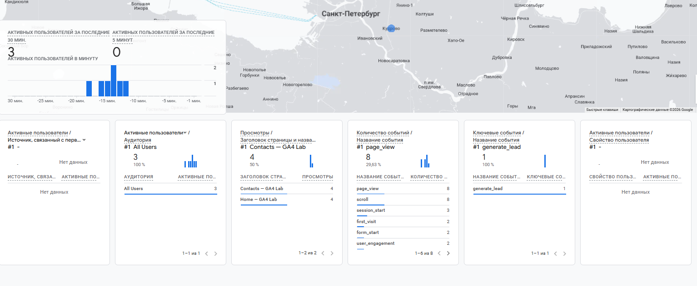
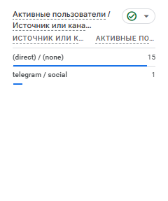

# Домашняя работа № 3 · Тег на сайте, источник и отчёты GA4

## Что надо было сделать

### 1. Мой сайт и мой ресурс

| Поле | Значение |
|---|---|
| Адрес репозитория сайта |  |
| Публичный адрес сайта |  |
| Статус публикации | READY / ERROR |
| Analytics Account |  |
| Property |  |
| Stream name |  |
| Website URL в потоке |  |
| Measurement ID (`G-…`) |  |
| Страницы с тегом |  |

Тег ставится на каждую страницу по одному разу: две копии дают двойные
события.

### 2. Тег установлен

**Результат проверки из инструкции тега:**

>

Скриншот: вставьте строку ``

Скриншот: вставьте строку ``

### 3. События доходят до аналитики

| Поле | Значение |
|---|---|
| Дата и время проверки |  |
| Какие страницы открывали |  |
| Какие события появились в Realtime |  |
| Число активных пользователей в момент проверки |  |

Скриншот: вставьте строку ``

### 4. Источник перехода определился

Ссылка собирается с метками `utm_source`, `utm_medium`, `utm_campaign`
и открывается на своём сайте.

**Ссылка целиком:**

```

```

| Поле | Значение |
|---|---|
| Где в GA4 виден источник |  |
| Какое значение источника показал GA4 |  |
| Совпадает с `utm_source` из ссылки | да / нет |

Скриншот: вставьте строку ``

Источник и кампания из UTM в отчёте Realtime не показываются: эти измерения
вычисляются при обработке данных. Если в Realtime источника нет, смотрите
отчёт по источникам трафика в разделе «Отчёты».

### 5. Статистика на странице «Отчёты»

| Показатель | Значение | Период |
|---|---|---|
| Пользователи |  |  |
| Сеансы |  |  |
| События |  |  |
| Самое частое событие |  |  |

Скриншот: вставьте строку ``

**Что видно по этим числам** (2–3 предложения):

>

### 6. Что не получилось

Если какой-то шаг не заработал, напишите какой, какое сообщение показал сервис
и что было проверено по таблице из `README.md`. Незаполненный раздел означает,
что всё получилось.

>

### 7. Использование ИИ

Тег вы устанавливаете, проверяете и снимаете кадры сами. ИИ допускается
для формулировок и оформления.

| Вопрос | Ответ |
|---|---|
| Что сделано самостоятельно |  |
| Что спрошено у модели |  |
| Что после этого изменено |  |

## Решение

### 1. Мой сайт и мой ресурс

| Поле                    |                                Значение                                 |
| ----------------------- | :---------------------------------------------------------------------: |
| Адрес репозитория сайта | [Адрес репозитория](https://github.com/DXlol112/ga4-analytics-lab_test) |
| Публичный адрес сайта   |        [Адрес сайта](https://ga4-analytics-lab-test.vercel.app)         |
| Статус публикации       |                                  READY                                  |
| Analytics Account       |                                  Dxlol                                  |
| Property                |                                 mysite                                  |
| Stream name             |                             Test-Analytics                              |
| Website URL в потоке    |                https://ga4-analytics-lab-test.vercel.app                |
| Measurement ID (`G-…`)  |                              G-E9RGMTYDFQ                               |
| Страницы с тегом        |                                   Все                                   |

Тег ставится на каждую страницу по одному разу: две копии дают двойные
события.

### 2. Тег установлен

**Результат проверки из инструкции тега:**

>Скриншот:
>Скриншот:

### 3. События доходят до аналитики

| Поле                                           |                                                Значение                                                |
| ---------------------------------------------- | :----------------------------------------------------------------------------------------------------: |
| Дата и время проверки                          |                                               26.09.2026                                               |
| Какие страницы открывали                       |                                                  Все                                                   |
| Какие события появились в Realtime             | page_view, scroll, first_visit, form_start, session_start, user_engagement, form_submit, generate_lead |
| Число активных пользователей в момент проверки |                                                   1                                                    |

Скриншот:

### 4. Источник перехода определился

Ссылка собирается с метками `utm_source`, `utm_medium`, `utm_campaign`
и открывается на своём сайте.

**Ссылка целиком:**

```
https://ga4-analytics-lab-test.vercel.app/?utm_source=telegram&utm_medium=post&utm_campaign=ga4_test
```

| Поле                                 | Значение         |
| ------------------------------------ | ---------------- |
| Где в GA4 виден источник             | В сводке отчётов |
| Какое значение источника показал GA4 | telegram         |
| Совпадает с `utm_source` из ссылки   | да               |

Скриншот:


Источник и кампания из UTM в отчёте Realtime не показываются: эти измерения
вычисляются при обработке данных. Если в Realtime источника нет, смотрите
отчёт по источникам трафика в разделе «Отчёты».

### 5. Статистика на странице «Отчёты»

| Показатель           | Значение  | Период                             |
| -------------------- | --------- | ---------------------------------- |
| Пользователи         | 16        | 29 авг. 2026 г. - 25 сент. 2026 г. |
| Сеансы               | 18        | 29 авг. 2026 г. - 25 сент. 2026 г. |
| События              | 220       | 29 авг. 2026 г. - 25 сент. 2026 г. |
| Самое частое событие | page_view | 29 авг. 2026 г. - 25 сент. 2026 г. |

Скриншот:


**Что видно по этим числам** (2–3 предложения):

>Сколько было пользователей, откуда они пришли, сколько было событий. Так же видно процентное соотношение сколько лидов отвалилась на каждом этапе воронки.  

### 6. Что не получилось

### 7. Использование ИИ

ИИ не использовался поскольку впн лежит уже 1 неделю, и некакак не воспользуешся им.

