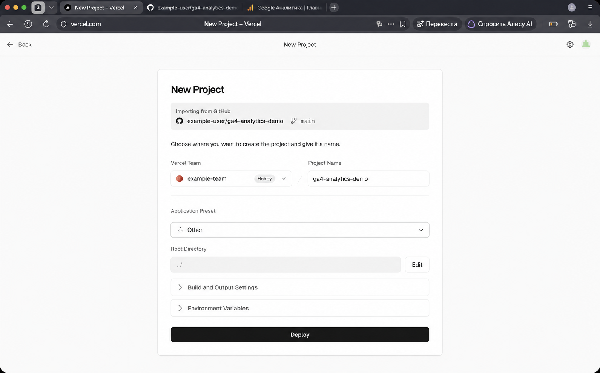
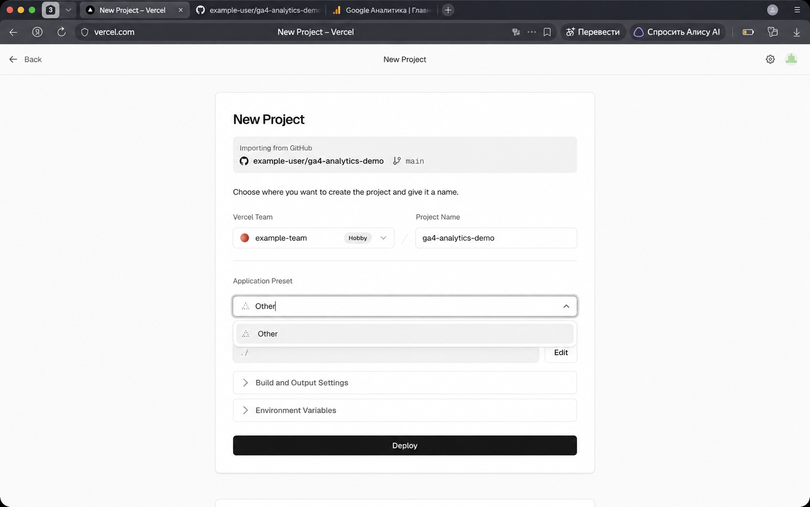

[← Оглавление](../../README.md)

# Vercel и Google Tag

## Общая схема

Сайт проходит путь от исходного кода до данных в Google Analytics 4:

`VS Code → GitHub → Vercel → сайт → Google Tag → Web Data Stream → GA4`

UTM-метки в ссылке дополняют эту схему. Они сообщают GA4, откуда пришёл пользователь.

## Роль каждого инструмента

| Инструмент | Назначение |
|---|---|
| **VS Code** | Редактирование файлов сайта. |
| **GitHub** | Хранение кода и истории изменений. |
| **Vercel** | Публикация сайта в интернете. |
| **Google Tag** | Передача событий из браузера в GA4. |
| **Web Data Stream** | Поток, который принимает данные сайта. |
| **GA4** | Обработка событий и создание отчётов. |
| **UTM-метки** | Описание источника перехода. |

Для учебной работы лучше использовать отдельную копию сайта. Это позволяет менять код и аналитику, не затрагивая рабочий проект.

## Статический сайт

Учебный проект состоит из HTML, CSS и JavaScript:

```text
project/
├── index.html
├── about.html
├── contacts.html
├── css/
│   └── style.css
└── js/
    └── script.js
```

Такой сайт называется статическим. Его HTML-файлы уже готовы к показу в браузере, поэтому отдельная сборка не нужна.

`index.html` обычно находится в корне проекта и служит главной страницей.

## GitHub и Vercel

GitHub хранит версии проекта. Vercel получает код из репозитория и создаёт опубликованную версию сайта.

Основная цепочка обновления:

`изменение кода → commit → push → deployment → production`

- **Commit** фиксирует версию проекта.
- **Push** отправляет её в GitHub.
- **Deployment** создаёт новую опубликованную версию.
- **Production** — основная версия сайта для пользователей.

Push ещё не означает, что сайт уже обновился. Новая версия появляется после успешного Deployment.



Для обычного проекта на HTML, CSS и JavaScript не нужен фреймворк. В Vercel он определяется как `Other`.



## Web Data Stream

Web Data Stream связывает сайт с ресурсом GA4. У него есть:

- адрес сайта;
- название потока;
- числовой Stream ID;
- Measurement ID вида `G-XXXXXXXXXX`.

При изменении адреса или названия существующего потока Measurement ID остаётся прежним.

URL в настройках потока сам по себе не устанавливает аналитику на сайт. Он также не запрещает принимать события с других доменов. Данные появляются только после подключения Google Tag.

## Google Tag

Google Tag — код, который загружается в браузере посетителя и отправляет события в нужный поток GA4.

Тег состоит из двух частей:

1. Подключение библиотеки `gtag.js`.
2. Настройка библиотеки на Measurement ID.

```html
<script async src="https://www.googletagmanager.com/gtag/js?id=G-XXXXXXXXXX"></script>
<script>
  window.dataLayer = window.dataLayer || [];
  function gtag(){dataLayer.push(arguments);}
  gtag('js', new Date());
  gtag('config', 'G-XXXXXXXXXX');
</script>
```

### Как работает код

- `async` загружает библиотеку параллельно и не останавливает показ страницы.
- `dataLayer` хранит очередь данных.
- `gtag()` добавляет команды в очередь.
- `gtag('js', new Date())` отмечает момент запуска.
- `gtag('config', ...)` включает сбор для нужного потока и создаёт первый `page_view`.

Очередь нужна потому, что события могут появиться раньше полной загрузки библиотеки.

Measurement ID не является паролем. Но он определяет адрес потока: при чужом ID события попадут в чужой ресурс.

На каждой HTML-странице должен быть один экземпляр тега. Если тега нет, страница не измеряется. Если код повторяется, события могут дублироваться.

## Передача первого события

При открытии страницы происходит следующая цепочка:

1. Браузер запрашивает страницу.
2. Vercel отдаёт HTML.
3. Браузер загружает Google Tag.
4. Tag отправляет событие `page_view`.
5. GA4 принимает событие.

Отчёт Realtime помогает проверить, что события дошли. В нём можно увидеть активных пользователей, страницы и `page_view`.

Счётчик активных пользователей не позволяет точно определить конкретного человека. Для проверки дополнительно сравнивают время события, название и путь страницы.

## UTM-метки и обработка данных

Google Tag передаёт в GA4 полный адрес страницы. Например:

```text
https://site.vercel.app/?utm_source=telegram&utm_medium=social&utm_campaign=ga4_lab
```

В запросе присутствуют основные данные:

- `tid` — Measurement ID;
- `en` — имя события, например `page_view`;
- `dl` — полный адрес страницы вместе с UTM-метками.

Tag не отправляет `utm_source`, `utm_medium` и `utm_campaign` отдельными полями. GA4 извлекает их из адреса страницы и выполняет атрибуцию позже.

Поэтому `page_view` может появиться в Realtime почти сразу, а источник, канал и кампания — через несколько часов. Первые данные нового потока иногда обрабатываются до 24–48 часов.

Realtime отвечает на вопрос: «Дошло ли событие?». Источники переходов смотрят после обработки в отчёте привлечения трафика.

## Что важно запомнить

- Публичный сайт и локальный сервер — разные версии проекта.
- GitHub хранит код, а Vercel публикует его.
- Google Tag передаёт события из браузера.
- Measurement ID направляет события в нужный поток GA4.
- Realtime показывает факт получения событий.
- UTM-источники появляются после обработки данных.
- Одного `page_view` мало для полного анализа: отдельно измеряют клики, формы, скачивания, регистрации и другие значимые действия.
