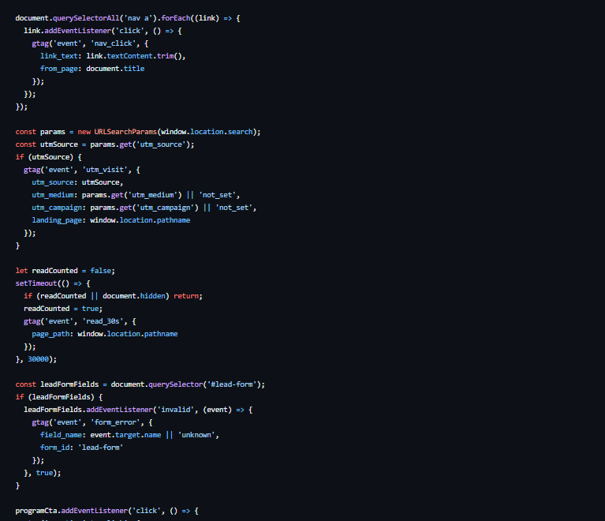
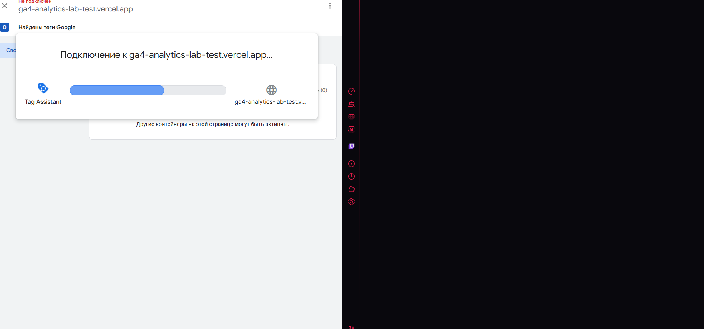
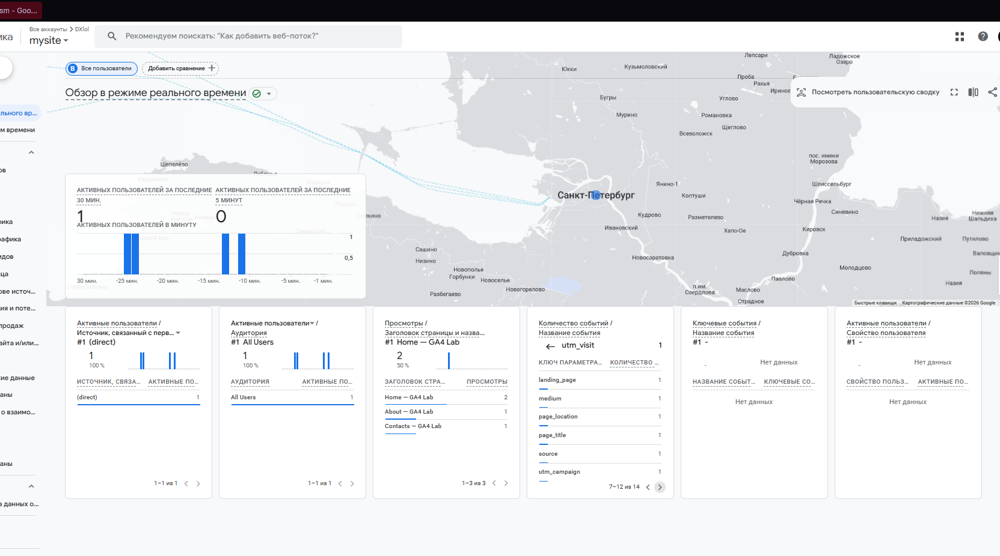
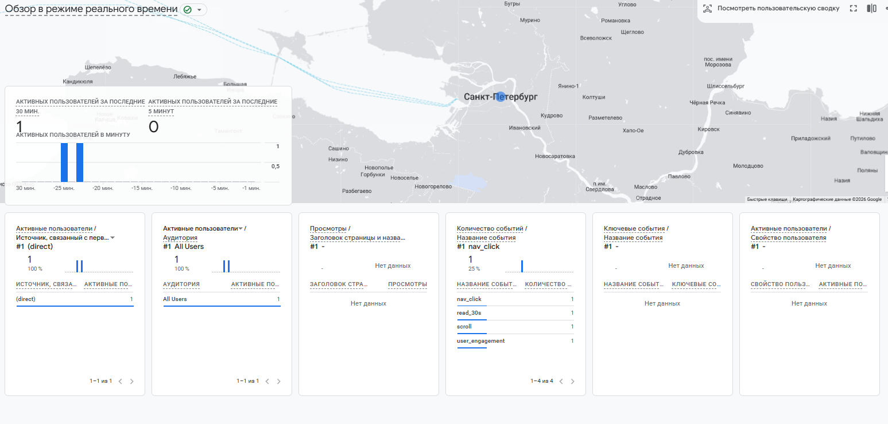

# Домашняя работа № 4 Свои события и параметры в GA4

## Что надо было сделать

### 1. Мой сайт и мой ресурс

| Поле | Значение |
|---|---|
| Публичный адрес сайта |  |
| Measurement ID (`G-…`) |  |
| Коммит с метриками (ссылка или первые 7 символов) |  |
| Статус публикации | READY / ERROR |
| Страницы, где подключён `js/metrics.js` |  |

Файл подключается после основного скрипта и на каждой странице по одному
разу: два подключения дают двойные события.

### 2. Какие метрики добавлены

| Событие | Что измеряет | Что делали, чтобы оно сработало |
|---|---|---|
| `nav_click` | клики по пунктам меню |  |
| `utm_visit` | метки кампании из адреса |  |
| `read_30s` | полминуты на странице |  |
| `form_error` | форма не прошла проверку браузера |  |

Скриншот: вставьте строку ``

### #3. События в DebugView

| Поле | Значение |
|---|---|
| Дата и время проверки |  |
| Как подключали отладку | Tag Assistant / `debug_mode` |
| Какие из четырёх событий пришли |  |
| Какие не пришли и почему |  |

Скриншот: вставьте строку ``

### 4. Параметры события `utm_visit`

**Ссылка, по которой открывали сайт:**

```

```

| Параметр | Значение в ссылке | Значение в GA4 |
|---|---|---|
| `utm_source` |  |  |
| `utm_medium` |  |  |
| `utm_campaign` |  |  |
| `landing_page` | — |  |

Скриншот: вставьте строку ``

Если значение в GA4 отличается от значения в ссылке, напишите, в чём разница
и почему так вышло.

>

### 5. Событие вне отладки

| Поле | Значение |
|---|---|
| Где проверяли | Realtime / Отчёты → Взаимодействие → События |
| Какое событие искали |  |
| Сколько срабатываний показал экран |  |
| Период (для отчёта) |  |

Скриншот: вставьте строку ``

### 6. Что эти метрики показывают про сайт

Два-три предложения: что вы узнали о поведении посетителей из четырёх
новых событий. Например, по каким пунктам меню ходят чаще, доходит ли
кто-то до получаса чтения, спотыкается ли форма.

>

### 7. Что не получилось

Если какая-то метрика не заработала, напишите какая, что показывал экран
и что было проверено по таблице из `README.md`. Незаполненный раздел
означает, что всё получилось.

>

### 8. Использование ИИ

Скрипты метрик выданы готовыми. Подключение, проверку и кадры вы делаете
сами. ИИ допускается для формулировок и оформления.

| Вопрос | Ответ |
|---|---|
| Что сделано самостоятельно |  |
| Что спрошено у модели |  |
| Что после этого изменено |  |

## Решение 

### 1. Мой сайт и мой ресурс

| Поле                                              | Значение                                                                                                                                                                                                                                                                                          |
| ------------------------------------------------- | ------------------------------------------------------------------------------------------------------------------------------------------------------------------------------------------------------------------------------------------------------------------------------------------------- |
| Публичный адрес сайта                             | https://ga4-analytics-lab-test.vercel.app                                                                                                                                                                                                                                                         |
| Measurement ID (`G-…`)                            | G-E9RGMTYDFQ                                                                                                                                                                                                                                                                                      |
| Коммит с метриками (ссылка или первые 7 символов) | [add/metric event listener](https://github.com/DXlol112/ga4-analytics-lab_test/commit/b797bf978efa0b78e933e00364b643c223701f22 "add/metric event listener")&[add/new metric](https://github.com/DXlol112/ga4-analytics-lab_test/commit/c4dc0c88842d31c0a2426ecb3d83ec947d187e6a "add/new metric") |
| Статус публикации                                 | READY                                                                                                                                                                                                                                                                                             |
| Страницы, где подключён `js/metrics.js`           | Все                                                                                                                                                                                                                                                                                               |

### 2. Какие метрики добавлены

| Событие      | Что измеряет                      | Что делали, чтобы оно сработало                                                                                                            |
| ------------ | --------------------------------- | ------------------------------------------------------------------------------------------------------------------------------------------ |
| `nav_click`  | клики по пунктам меню             | Добавил метрику в js/script.js добавил тег и ивент до события -> Сделал деплой                                                             |
| `utm_visit`  | метки кампании из адреса          | Добавил метрику в js/script.js, собираю utm метки разбираю по содержимому и редактирую для во избежания кривой информации -> Сделал деплой |
| `read_30s`   | полминуты на странице             | Добавил метрику в js/script.js, таймер + тег  -> Сделал деплой                                                                             |
| `form_error` | форма не прошла проверку браузера | Добавил метрику в js/script.js, добавил ивент на ожидания не валидной информации + тег  -> Сделал деплой                                   |

Скриншот:


### #3. События в DebugView

| Поле                            | Значение                     |
| ------------------------------- | ---------------------------- |
| Дата и время проверки           | 27.09.26 12:12               |
| Как подключали отладку          | Tag Assistant & `debug_mode` |
| Какие из четырёх событий пришли | Раньше до 21 сентября приходили нормально, но сейчас из-за действий Роскомнадзором, даже запустить не удаётся.                          |
| Какие не пришли и почему        | Не грузит сайт на vercel, а vpn не работает.                        |

Скриншот: И так уже минут 10+ 


### 4. Параметры события `utm_visit`

**Ссылка, по которой открывали сайт:**

```
https://ga4-analytics-lab-test.vercel.app/?utm_source=telegram&utm_medium=post&utm_campaign=ga4_test
```

| Параметр       | Значение в ссылке | Значение в GA4 |
| -------------- | ----------------- | -------------- |
| `utm_source`   | telegram          | telegram       |
| `utm_medium`   | post              | post           |
| `utm_campaign` | ga4_test          | ga4_test       |
| `landing_page` | —                 | Home           |

Скриншот:



### 5. Событие вне отладки

| Поле                               |                   Значение                   |
| ---------------------------------- | :------------------------------------------: |
| Где проверяли                      | Realtime / Отчёты → Взаимодействие → События |
| Какое событие искали               |                     utm                      |
| Сколько срабатываний показал экран |                      1                       |
| Период (для отчёта)                |      30 авг. 2026 г. - 26 сент. 2026 г.      |

Скриншот:

### 6. Что эти метрики показывают про сайт

Два-три предложения: что вы узнали о поведении посетителей из четырёх
новых событий. Например, по каким пунктам меню ходят чаще, доходит ли
кто-то до получаса чтения, спотыкается ли форма.

> Чаше пользователь отваливаются на начале, лишь 20+- до ходят до конца. Пользователи задерживаются на сайте не более 5+- минут
