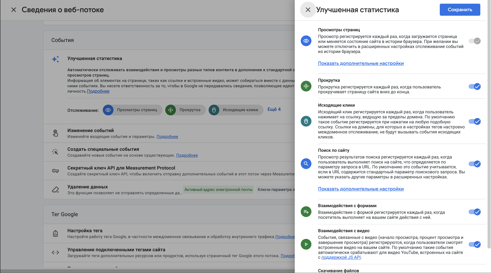
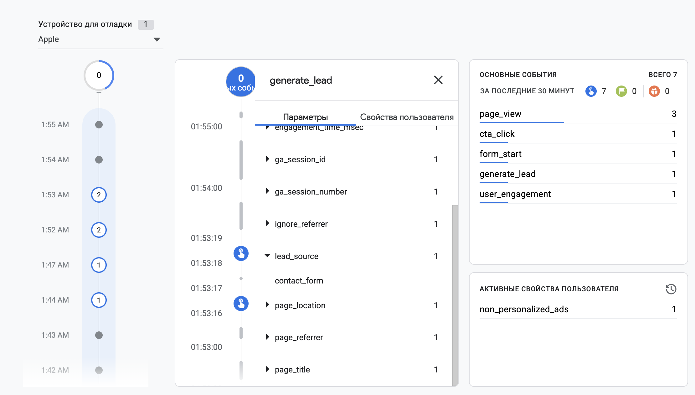
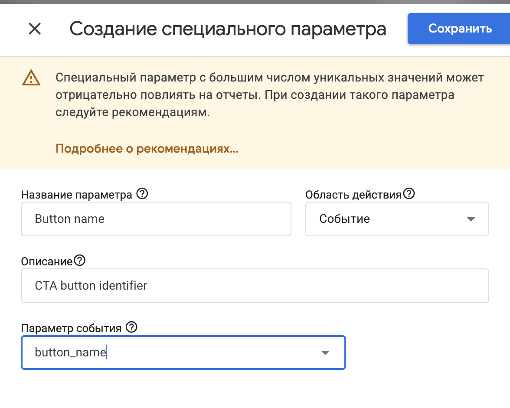
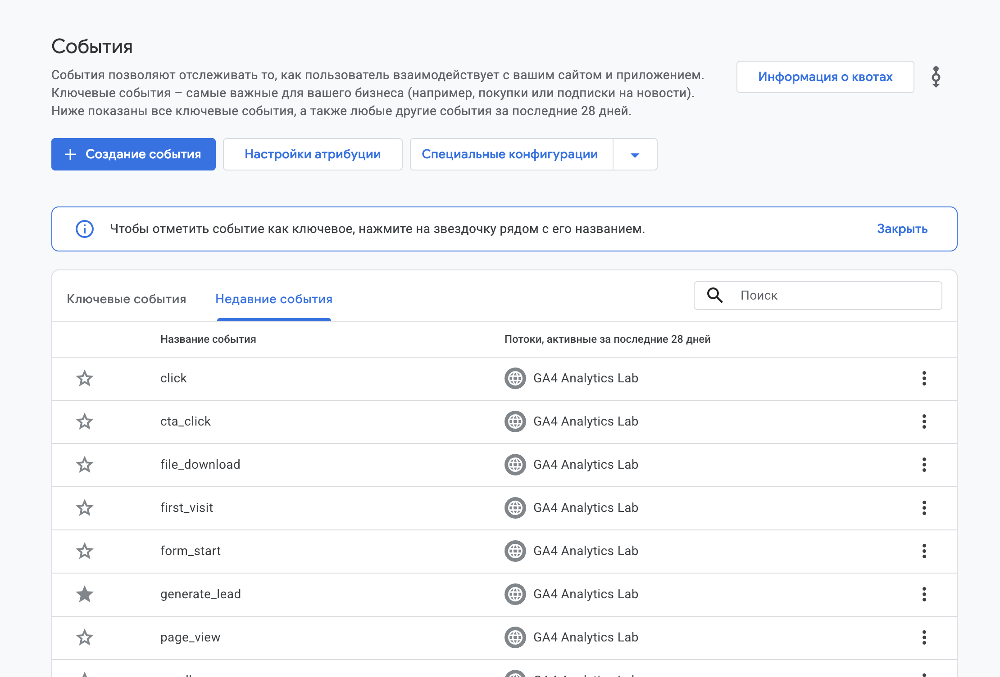

[← Оглавление](../../README.md)

# События GA4

## Событийная модель

GA4 получает данные о действиях посетителя в виде событий. **Имя события** отвечает на вопрос «что произошло», а **параметры** уточняют детали.

Например, `cta_click` означает нажатие кнопки призыва к действию (CTA), `button_name=program` указывает кнопку, а `page_section=hero` — блок страницы.

Путь данных: `действие → автоматическое измерение или JavaScript → Google Tag → GA4`.

## Виды событий

| Вид | Как собирается |
|---|---|
| **Автоматически собираемые** | Базовым тегом: например, `session_start`. |
| **Enhanced Measurement** | Поддерживаемые взаимодействия при включённой «Улучшенной статистике». |
| **Рекомендуемые** | Отправку реализуют самостоятельно, используя имя Google: например, `generate_lead`. |
| **Собственные** | Имя и параметры определяют под задачу: например, `cta_click`. |

Перед добавлением события важно учитывать уже работающий автоматический сбор: иначе одно действие может посчитаться дважды.

## Автоматические измерения

| Событие | Что означает |
|---|---|
| `page_view` | Просмотр страницы. На обычном HTML-сайте отправляется при загрузке Google Tag. |
| `scroll` | Достижение 90% вертикальной глубины страницы; один раз за просмотр. |
| `click` | Переход по внешней ссылке на другой домен. |
| `file_download` | Клик по ссылке на файл поддерживаемого расширения, например PDF или ZIP. |
| `form_start` | Первое взаимодействие с формой в сессии. |
| `form_submit` | Технический сигнал отправки формы. |

Автоматический `click` не охватывает все кнопки и внутренние ссылки. `file_download` фиксирует выбор ссылки, а `form_submit` сам по себе не подтверждает сохранение заявки сервером. Измерение форм зависит от их реализации.

## Параметры и собственные события

Один тип действия удобно описывать общим именем, а различия — параметрами:

- `click`: `link_url`, `link_domain`, `outbound`;
- `file_download`: `file_name`, `file_extension`, `link_text`;
- `generate_lead`: `lead_source=contact_form`;
- `cta_click`: `button_name`, `page_section`.

Отправка через `gtag()` содержит команду `event`, имя события и объект параметров. Обработчик JavaScript связывает её с действием на сайте.

Имена чувствительны к регистру. Для собственных событий используют понятные английские имена в `lowercase_snake_case`, начиная с буквы, без зарезервированных имён и префиксов.

В реальном процессе `generate_lead` связывают с успешным получением заявки. В статическом примере презентации этот результат только моделируется. Имя, email, телефон и другие персональные данные не передают в GA4, включая параметры и URL.

## Realtime и DebugView

**Realtime** показывает недавнюю активность. **DebugView** показывает последовательность событий устройств с включённой отладкой и параметры конкретного события. Он помогает обнаружить пропуски, неверные значения и повторные срабатывания.

## Custom Dimensions

**Custom Dimension** — регистрация собственного параметра как измерения для отчётов. Например, параметр `button_name` становится разрезом «Button name», позволяющим сравнить кнопки по числу нажатий.

Для параметров события используется область действия **Event**. Ключ параметра должен точно совпадать с ключом в JavaScript, включая регистр.

Для просмотра параметра в DebugView регистрация не нужна. В отчётах новое измерение обычно становится доступно через 24–48 часов; прежние события не заполняются задним числом. `(not set)` указывает на отсутствие значения, например у события без параметра или до регистрации измерения.

## Ключевые события и воронка

**Key Event** — событие, отмеченное в GA4 как важный результат, например заявка. Пометка позволяет сравнивать результативность источников; она сама не создаёт и не отправляет событие.

UTM-метки описывают привлечение, а ключевое событие — результат визита. `lead_source=contact_form` обозначает форму и не заменяет источник сессии.

Из последовательности `page_view → cta_click → form_start → generate_lead` строят воронку. Каждый следующий шаг учитывает пользователей, прошедших предыдущие этапы, и помогает увидеть, где они прекращают путь.
