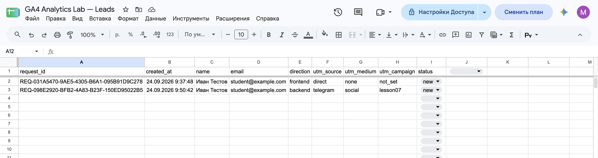
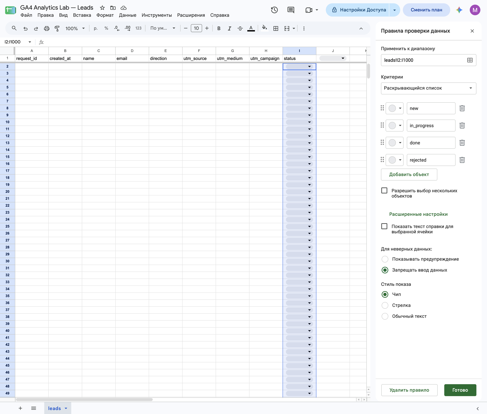
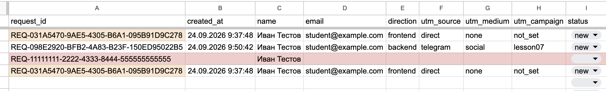

[← Оглавление](../../README.md)

# Google Sheets и заявки

## Событие и запись заявки

**Событие GA4** описывает действие посетителя. **Заявка** — запись с данными, которую можно найти и обработать.

Одна отправка формы запускает два независимых потока:

- `форма → Google Tag → GA4`: событие `generate_lead`;
- `форма → HTTP POST → Apps Script → Google Sheets`: сохранение заявки после проверки.

В примере этой презентации `generate_lead` означает попытку отправки. Наличие события не доказывает сохранение строки: аналитика может сработать при ошибке приёмника, а заявка — сохраниться при блокировке GA4.

## Структура таблицы

Основное правило: **одна строка — одна заявка, один столбец — одно поле**. Все источники используют общую структуру листа `leads`.

| Поле | Назначение и источник |
|---|---|
| `request_id` | Уникальный ID заявки; создаётся в браузере, проверяется сервером. |
| `created_at` | Дата и время записи; назначает сервер. |
| `name`, `email`, `direction` | Имя, почта и направление; вводит пользователь. |
| `utm_source`, `utm_medium`, `utm_campaign` | Источник, канал и кампания; извлекаются из URL. |
| `status` | Состояние обработки; начальное значение `new` назначает сервер. |

`request_id` не зависит от номера строки и сохраняется при её перемещении. Он помогает находить заявку и обнаруживать повторную доставку. Одинаковый email может принадлежать разным заявкам; технический дубль в этой модели определяется одинаковым `request_id`.

Сервер создаёт `created_at`, поскольку часы устройства посетителя могут быть неверными. Формат отображения даты и часовой пояс таблицы должны быть согласованы.

## UTM вместе с заявкой

Сохранённые UTM связывают источник привлечения с конкретной заявкой и её дальнейшим статусом. Например: `telegram / social / september`.

Если меток нет, учебный приёмник использует:

- `utm_source = direct`;
- `utm_medium = none`;
- `utm_campaign = not_set`.

Это условные значения проекта: они не гарантируют совпадения с атрибуцией GA4. В показанной реализации метки читаются с текущей страницы формы; для сохранения при переходах между страницами нужен отдельный механизм.

## Статусы и качество данных

Для состояния заявки используется ограниченный словарь:

| Статус | Значение |
|---|---|
| `new` | Новая заявка. |
| `in_progress` | Заявка обрабатывается. |
| `done` | Обработка завершена. |
| `rejected` | Заявка отклонена. |

**Data Validation** ограничивает ручной ввод допустимыми значениями и помогает избежать вариантов вроде `NEW`, «готово» и `finished`.

Обязательны `request_id`, `created_at`, `name`, `email`, `direction` и `status`. UTM могут отсутствовать и заменяются условными значениями.

**Условное форматирование** выделяет неполные строки и повторяющиеся ID. Оно показывает ошибки в таблице; отказ в сохранении дубля обеспечивает серверная проверка.

## Роль Google Apps Script

**Google Apps Script** выполняет JavaScript на стороне сервисов Google. Опубликованный **Web App** предоставляет HTTP endpoint — адрес приёма запросов.

POST-запрос вызывает `doPost(e)`. Поля формы доступны в `e.parameter`; приёмник очищает пробелы, проверяет обязательные значения и ID, назначает время и статус, затем добавляет строку через `appendRow()`.

Доступ к таблице находится у серверного скрипта. Браузер обращается к URL приёмника.

**Клиентская валидация** (`required`, тип поля) помогает пользователю заполнить форму. **Серверная валидация** повторно проверяет входящие данные, поскольку браузерные ограничения и скрытые поля можно изменить.

Проверка дубля и запись выполняются под одной блокировкой **ScriptLock**: одновременные запросы с одним ID не должны создать две строки. Значения `created_at` и `status` сервер определяет самостоятельно.

## Подтверждение и дальнейшая обработка

В учебной схеме ответ POST направляется в скрытый iframe, поэтому пользователь остаётся на сайте. Страница пока не обрабатывает JSON-ответ приёмника; подтверждением сохранения служит строка в Sheets. Поля JSON `ok` и `error` описывают результат обработки и не равнозначны HTTP-статусу.

Имя и email хранятся в таблице заявок; в GA4 отправляют параметры действия без персональных данных.

Apps Script здесь служит простым приёмником. Для полноценной системы нужны дополнительные средства авторизации, защиты от спама и обработки ошибок.

Единые поля, идентификаторы и справочники делают таблицу пригодной для аналитики и передачи в другие системы. Данные можно экспортировать в CSV и очищать через **Power Query**: убрать пробелы, нормализовать значения и обработать ошибки. Сохранённые шаги преобразований повторяются при обновлении данных через **Refresh**.
