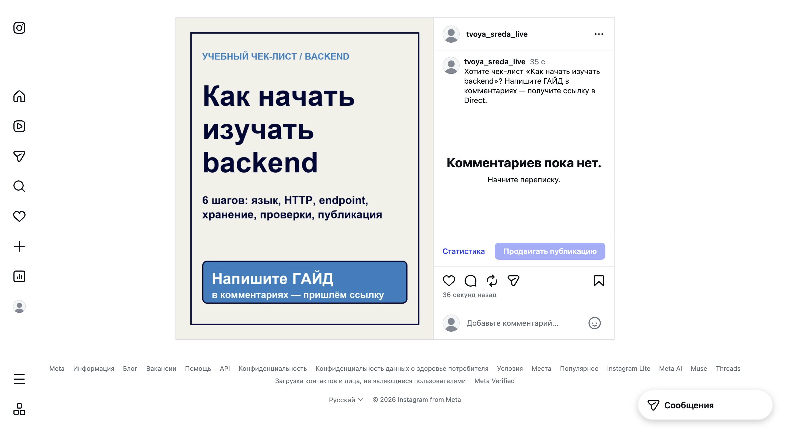
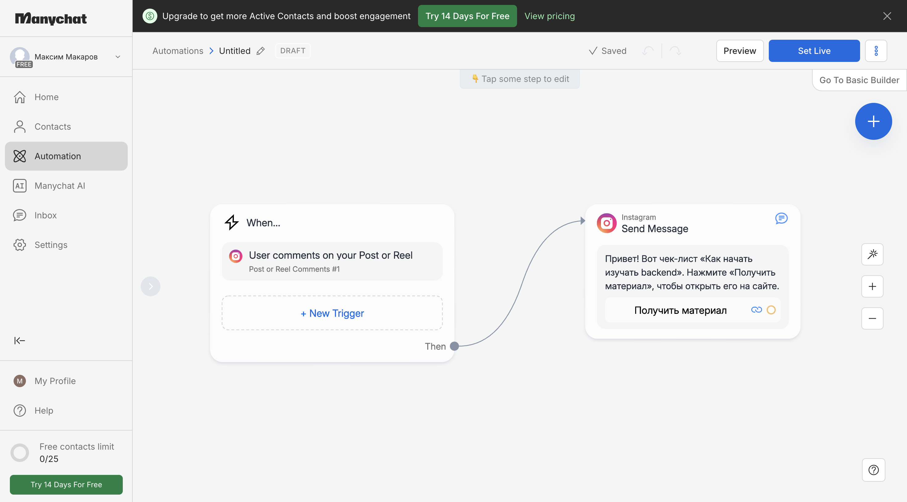
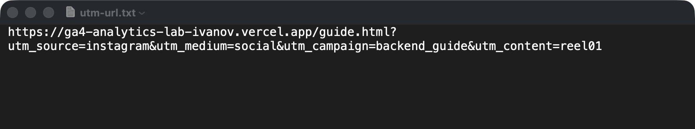
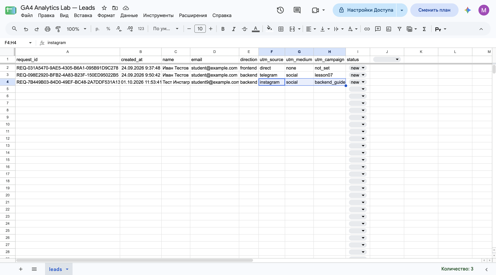
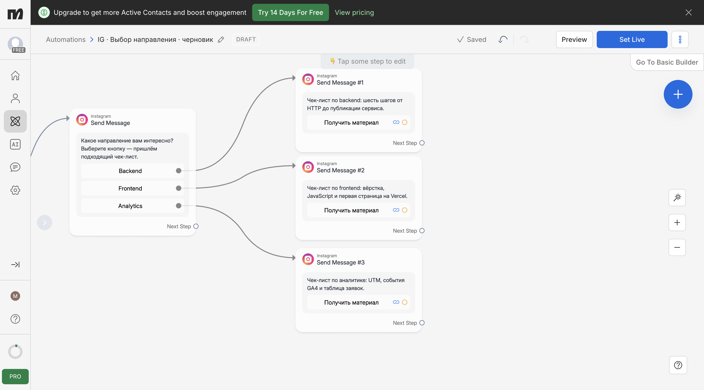

[← Оглавление](../../README.md)

# Instagram и ManyChat: автоворонка

## Что такое автоворонка

**Автоворонка** — последовательность действий системы после события пользователя. В примере посетитель видит публикацию Instagram, пишет «ГАЙД» в комментарии, получает личное сообщение с кнопкой и переходит на сайт. После перехода он может оставить заявку.

ManyChat служит промежуточным слоем между Instagram и сайтом: получает разрешённые события, проверяет условие и отправляет ответ. Для показанного подключения используется профессиональный аккаунт Instagram типа Creator или Business и доступ к сообщениям и комментариям. Возможности автоматизации зависят от разрешений, типа подключения и тарифа.

## Trigger, Condition и Action

- **Trigger** — событие, запускающее сценарий: комментарий под выбранной публикацией.
- **Condition** — условие отбора: комментарий содержит «ГАЙД».
- **Action** — действие системы: отправка Private Reply в Direct.

Привязка к одной публикации и ключевому слову отделяет целевое обращение от любых других комментариев. Само получение сообщения сайт не открывает: переход происходит только после нажатия кнопки **Open Website**.

В показанном сценарии кнопка с внешней ссылкой не создаёт согласие на продолжение переписки и не открывает 24-часовое окно сообщений. Для следующих сообщений нужно отдельное взаимодействие пользователя.

## UTM описывают переход

Ссылка из сообщения содержит четыре метки:

| Метка | Пример | Смысл |
|---|---|---|
| `utm_source` | `instagram` | Площадка, откуда пришли. |
| `utm_medium` | `social` | Тип канала по соглашению проекта. |
| `utm_campaign` | `backend_guide` | Конкретная воронка. |
| `utm_content` | `reel01` | Конкретная публикация. |

UTM в адресе показывают контекст перехода. Проверка `page_location` с метками и отчёта GA4 об источнике сеанса — разные проверки; источник первого посещения и источник сеанса также имеют разную область действия.

## Где хранятся данные

`Instagram → ManyChat → ссылка с UTM → сайт` описывает привлечение. На сайте GA4 получает события поведения, например `page_view`, `form_start` и `generate_lead`. Сама заявка проходит через форму и Apps Script в Google Sheets.

**Событие `generate_lead` и сохранённая строка заявки — разные сигналы.** Их появление проверяют независимо. В учебной схеме в строке `leads` сохраняются `utm_source`, `utm_medium` и `utm_campaign`; `utm_content` остаётся в URL и не имеет отдельного столбца таблицы.

GA4 измеряет действия на сайте, но не просмотры публикации или чтение сообщения в Instagram. Для анализа всей воронки сопоставляют данные нескольких систем и сравнимые периоды.

## Ветвление и границы измерения

После одного Trigger сценарий может разделиться по интересу пользователя: Backend, Frontend или Analytics. Каждая ветка ведёт к своему материалу и может иметь своё значение `utm_campaign`; смена метки сама по себе не меняет содержимое сайта.

Результативность оценивают по последовательности «публикация → комментарий → Direct → переход → действие на сайте → заявка». Источники данных для ранних этапов — Instagram и ManyChat; этапы сайта исследуют в GA4, а созданную заявку и её статус — в Sheets.
