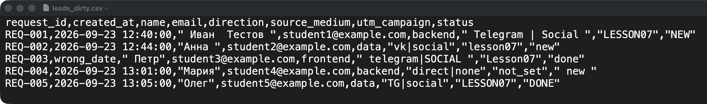
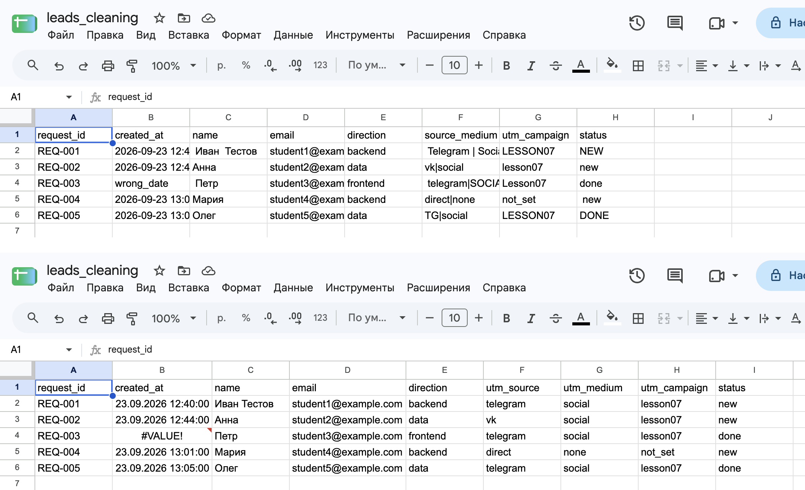
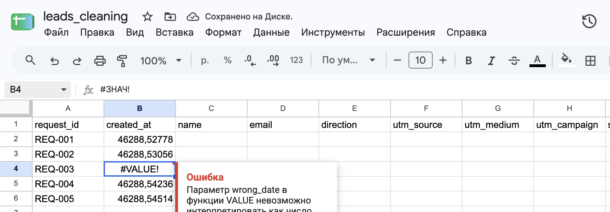
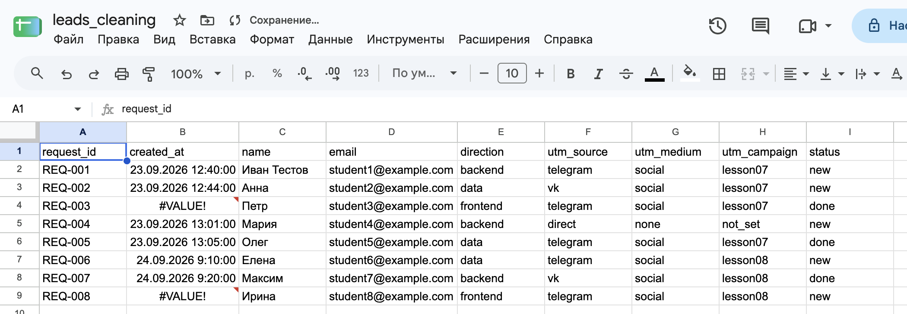

[← Оглавление](../../README.md)

# Очистка данных в Google Таблицах

## Зачем нужны правила очистки

Выгрузка заявок из Google Sheets может содержать лишние пробелы, разные написания одного источника, текст вместо даты и объединённые поля. Ручные исправления трудно повторить для следующей выгрузки. **Повторяемая очистка** хранит правила отдельно от исходных данных и применяет их к каждой новой версии файла.

Схема похожа на ETL: **Extract** — получить CSV, **Transform** — преобразовать значения, **Load** — получить таблицу для анализа. В презентации преобразования выполняют формулы Google Таблиц; тот же принцип повторяемых шагов используется в Power Query.

## Источник, правила и результат

Лист `source` хранит импортированный CSV без ручных исправлений. Лист `leads_clean` содержит очищенные данные. Формулы ссылаются на исходные столбцы, например `source!A2:A`, и пересчитываются при изменении источника.

`ARRAYFORMULA` позволяет задать правило в одной ячейке второй строки для всего столбца. Полученные значения занимают ячейки ниже; ручной ввод в этом диапазоне мешает выводу массива и вызывает `#REF!`.

**Контракт данных** заранее определяет названия и порядок столбцов, типы и допустимые значения. Результат содержит девять полей заявки: `request_id`, `created_at`, `name`, `email`, `direction`, три UTM-поля и `status`.

## Типы и текстовые значения

`request_id` остаётся текстом: идентификатор не нужен для вычислений. `created_at` преобразуется в тип «дата и время», чтобы записи можно было корректно сравнивать и сортировать. Автоматическое распознавание типов при импорте может неверно прочитать дату или убрать ведущие нули из ID, поэтому правило преобразования задано явно.

Текстовые поля нормализуют последовательными функциями:

| Правило | Роль |
|---|---|
| `ПЕЧСИМВ` | Удаляет невидимые управляющие символы. |
| `СЖПРОБЕЛЫ` | Убирает пробелы по краям и повторные пробелы внутри. |
| `SPLIT` | Разделяет `source|medium` на `utm_source` и `utm_medium`. |
| `СТРОЧН` | Приводит категории к нижнему регистру: `Telegram` → `telegram`. |

Функции выполняются изнутри наружу. Смена регистра не расшифровывает сокращения: `TG` становится `tg`. Замена `tg → telegram` нужна как отдельное согласованное правило после очистки текста. Неизвестное значение статуса нельзя автоматически объявлять `done` без подтверждённого значения.

## Ошибки остаются видимыми

Значение `wrong_date` не преобразуется в дату и даёт `#VALUE!`. Такая ошибка показывает конкретную проблемную строку; пустая подстановка скрыла бы причину и превратила заявку в запись без даты.

Есть и **ошибка структуры**: если в новой CSV-выгрузке изменится порядок столбцов, формулы по буквенным адресам могут взять данные из чужого поля без сообщения об ошибке. Поэтому проверяют заголовки и структуру отдельно от значений.

Очистка формата не заменяет контроль качества всей таблицы. Дополнительно выявляют дубли `request_id`, пустые обязательные поля, неизвестные статусы и потерянные строки.

## Повторное применение

Новая выгрузка заменяет содержимое того же листа `source`; формулы `leads_clean` остаются прежними и пересчитывают результат. Так сохраняется способ обработки, а не вручную исправленная версия одной таблицы.

